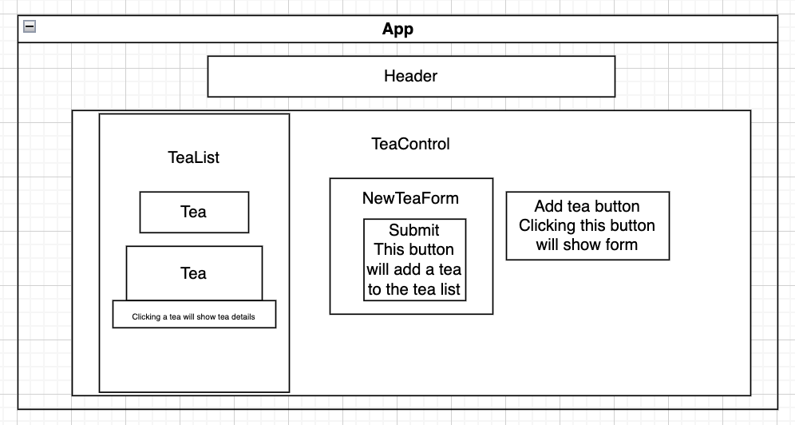

# 🍵🍵🍵🍵Uncle Iroh's Tea Shop Inventory Tracker🍵🍵🍵🍵

  

Welcome to the Uncle Iroh's Tea Shop Inventory Tracker! This web application is designed to help you manage your tea inventory with ease. The user is able to track their inventory of loose leaf tea after sales of 1 oz. Below, you'll find a detailed guide on how to set up and use this application effectively.

## Table of Contents

1. [Getting Started](#getting-started)
2. [Component Tree](#component-tree)
3. [Features](#features)
4. [Themes](#themes)
5. [Usage](#usage)
6. [Future Improvements](#future-improvements)
7. [Feedback and Support](#feedback-and-support)

## Getting Started

To set up the Local Tea Shop Inventory Tracker on your local machine, follow these steps:

1. Clone the repository: 

2. Install dependencies:
`npm install`
3. Start the application:
`npm start`

4. Open your preferred web browser and go to `http://localhost:3000` to access the application.

## Component Tree

![component diagram] (./drawio.svg)

## Features

The application provides the following functionalities:

1. View a list/menu of all available types of tea.
2. See details for each tea item, including name, origin, price, and type (e.g., green, black, herbal).
3. Add a new crate of tea to the inventory.
4. Click on a crate to view its detail page.
5. See the remaining ounces of tea in a crate. Each crate contains roughly 130 ounces.
6. Sell an ounce of tea with a single click. The remaining ounces will update accordingly.

## Tree
- One crate of tea contains 130 ounces of loose-leaf tea.
- Every sale decrements one ounce of tea from the crate until it is empty.

## Usage

1. **Viewing Available Tea Options**
- Upon opening the application, you'll see a list of available types of tea. Click on any item to view its details. For each item, the user can see its name, origin, price, and type (e.g., green, black, herbal).

2. **Adding a New Crate of Tea**
- Navigate to the "Add New Tea Crate" page and fill in the required details (name, origin, price, type, and quantity).

3. **Viewing Tea Details**
- Click on a crate to see its detailed information, including the remaining ounces.

4. **Selling Tea**
- On the detail page, you'll find a "Sell One Ounce" button. Click it to make a sale. The remaining ounces will be updated.

## Future Improvements

Here are some potential areas for improvement:

- Header currently cut off when multiple teas added
- Adding user authentication for secure access.
- Enhancing the UI for a more user-friendly experience.

## Feedback and Support

If you have any feedback, suggestions, or need support, please feel free to reach out via GitHub.

Enjoy using the Uncle Iroh's Tea Shop Inventory Tracker!

## License
MIT

Copyright (c) 2023 Natalie Benjes

Permission is hereby granted, free of charge, to any person obtaining a copy of this software and associated
documentation files (the “Software”), to deal in the Software without restriction, including without limitation the
rights to use, copy, modify, merge, publish, distribute, sublicense, and/or sell copies of the Software, and to permit
persons to whom the Software is furnished to do so, subject to the following conditions:

The above copyright notice and this permission notice shall be included in all copies or substantial portions of the
Software.

THE SOFTWARE IS PROVIDED “AS IS”, WITHOUT WARRANTY OF ANY KIND, EXPRESS OR IMPLIED, INCLUDING BUT NOT LIMITED TO THE
WARRANTIES OF MERCHANTABILITY, FITNESS FOR A PARTICULAR PURPOSE AND NONINFRINGEMENT. IN NO EVENT SHALL THE AUTHORS OR
COPYRIGHT HOLDERS BE LIABLE FOR ANY CLAIM, DAMAGES OR OTHER LIABILITY, WHETHER IN AN ACTION OF CONTRACT, TORT OR
OTHERWISE, ARISING FROM, OUT OF OR IN CONNECTION WITH THE SOFTWARE OR THE USE OR OTHER DEALINGS IN THE SOFTWARE

**Happy Brewing!** 🍵
